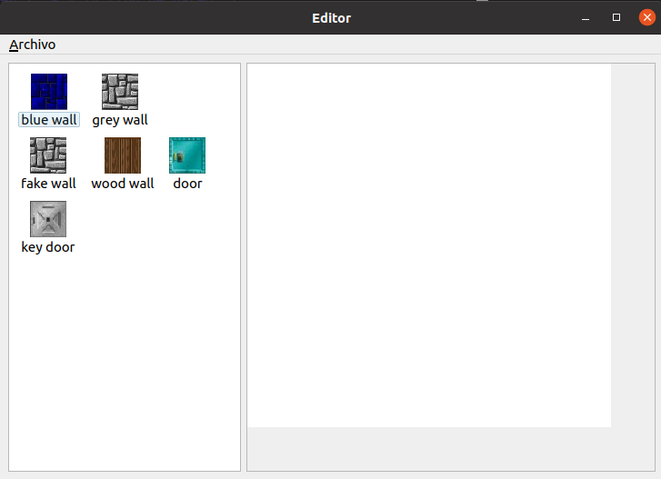
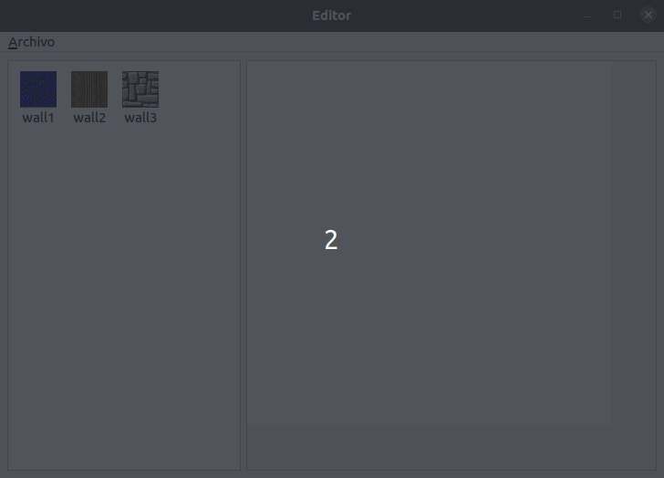
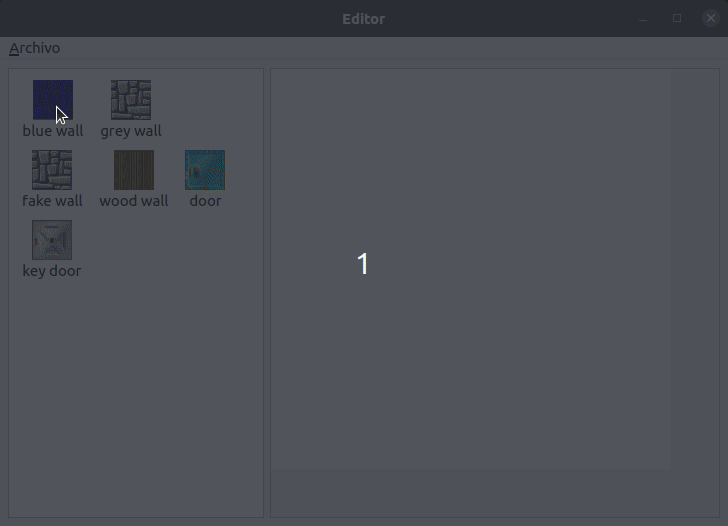
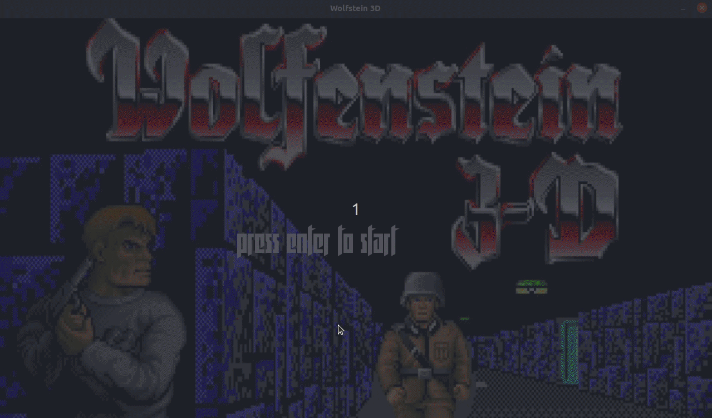
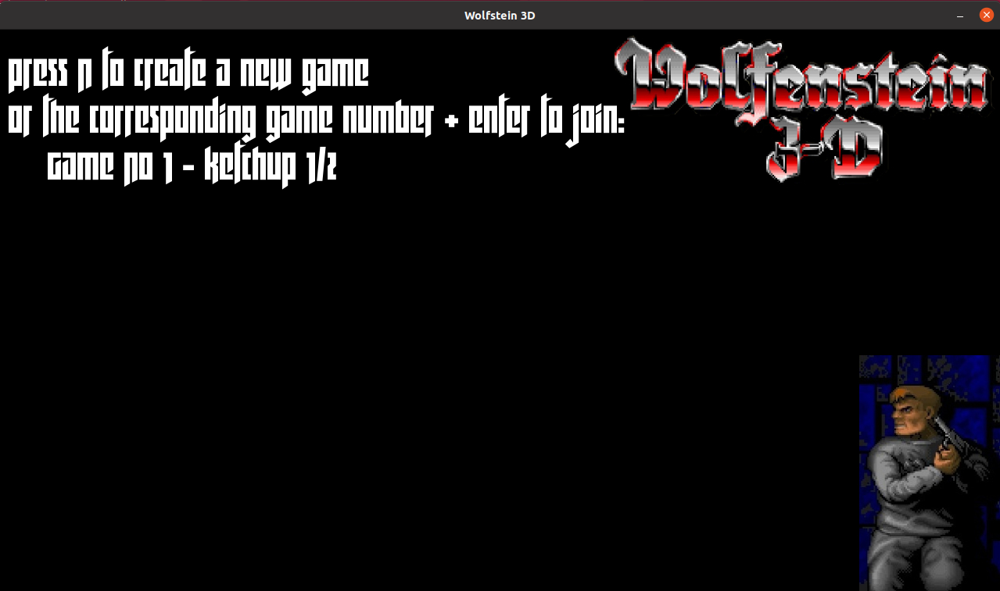
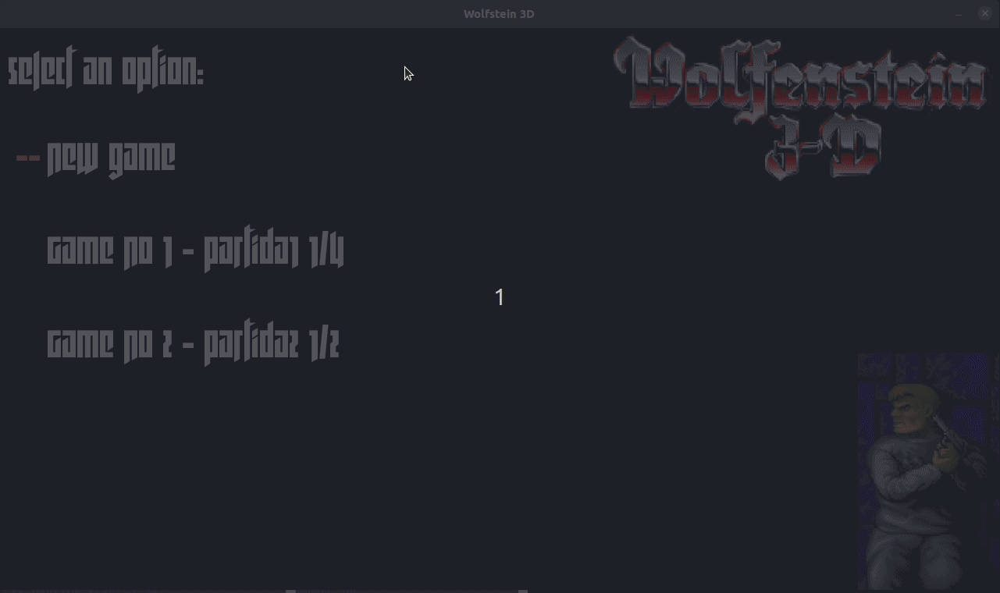

# [75.42] Taller de programación I
## Trabajo práctico final: Wolfenstein 3D

**Fontenla, Maria Sol**  
103870  
**msfontenla@fi.uba.ar**

**Izquierdo Osorio,  Stephanie**  
104196  
**sizquierdo@fi.uba.ar**

**Segura, Agustina**  
104222  
**asegura@fi.uba.ar**

**Serra, Camila**  
97422  
**cserra@fi.uba.ar**

___

## Introducción

* [Manual de Proyecto](#)
  + [Enunciado](#)
  + [División de tareas](#)
  + [Evolución del proyecto](#)
    + [Cronograma propuesto](#)
    + [Cronograma real](#)
  + [Inconvenientes encontrados](#)
  + [Análisis de puntos pendientes](#)
  + [Herramientas](#)
  + [Conclusiones](#)
* [Documentación técnica](#doc)
  + [Requerimientos de software](#)
  + [Descripción general](#)
  + [Módulo N](#)
    + [Descripción general](#)
    + [Clases](#)
    + [Diagramas UML](#)
    + [Descripción de archivos y protocolos](#)
  + [Programas intermedios y de prueba](#)
* [Manual de Usuario](#manual)
  + [Instalación](#)
    + [Requerimientos de software](#)
    + [Requerimientos de hardware](#)
    + [Proceso de Instalación](#)
  + [Configuración](#)
  + [Forma de uso](#)
  + [Apéndice de errores](#)


## Manual de Proyecto

### Enunciado
El proyecto consiste en realizar un remake del [Wolfenstein 3D  (1992)](https://es.wikipedia.org/wiki/Wolfenstein_3D). Será un juego multijugador, donde cada jugador será William B.J. Blazkowicz y verá al resto de los jugadores como oficiales Nazis.

El enunciado completo se puede encontrar [acá](enunciado.pdf).

### Evolución del proyecto

#### Cronograma propuesto

* **Semana 1**  
  * Carga de mapas, lógica de movimiento de los personajes (colisión con las paredes y otros objetos).   
  * Mostrar una imagen y una animación. Reproducir sonidos y música. Mostrar texto en pantalla.  
  * Ecuación de los rayos (donde intersecciona con cada celda)  
  * Draft del editor.
* **Semana 2**  
  * Lógica de las partidas.Lógica del ataque.
  * Modulo IA basico.
  * Vista 3D las paredes usando ray casting. Sin texturas ni objetos ni otros jugadores
  * Editor basico
* **Semana 3**  
  * Sistema de comunicación (cliente - servidor)
  * Modulo IA completo.
  * Vista 3D incluyendo las texturas de las paredes, objetos y jugadores.
  * Editor completo.
* **Semana 4**  
  * Servidor completo.
  * Configuración.
  * Cliente completo. Pantalla de login y de partidas.
* **Semana 5**  
  * Pruebas y corrección sobre estabilidad del servidor.
  * Detalles finales y documentación preliminar
  * Pruebas y corrección sobre estabilidad del cliente.
  * Detalles finales y documentación preliminar
  * Pruebas y corrección sobre estabilidad del cliente.
  * Detalles finales y documentación preliminar
* **Semana 6**  
  * Correcciones sobre
  * Testing y corrección de bugs
  * Documentación
* **Semana 7**  
  * Testing
  * Documentación
  * Armado del entregable

#### Cronograma real
Tratamos de seguir el cronograma propuesto pero hubo varios defasajes por complicaciones (como las mencionadas en la  próxima sección). Tampoco hicimos un seguimiento de la evolución semana por semana.

### Inconvenientes encontrados  
* Algunos de los inconvenientes encontrados estuvieron relacionados con la parte gráfica del juego. Por ejemplo, con el algoritmo de raycasting, cuyo desarrollo debió modificarse mas vez debido a problemas con los tipos de datos elegidos para su desarrollo. Ademas, al momento de renderizar a los sprites, también hubo inconvenientes con parámetros que estaban por fuera del rango de la pantalla del juego, con lo cual no podia verse en pantalla las entidades que debían. A esto se le debe agregar el tiempo de cpu que toma renderizar el mapa y todos sus contenidos, el cual es alto y produce una desincronizacion entre el procesado de comandos del lado del servidor y el procesado de actualizaciones del lado del cliente.  
* Por otro lado, se hallaron dificultades a la hora de serializar y deserializar las distintas entidades del juego. Al ser un protocolo binario, había que tener un especial cuidado a la hora de desarrollarlo. Su desarrollo se encuentra en las siguientes secciones. Ademas, se debió tener en cuenta que las computadoras que corren el juego pueden tener distinto endianness.  
* Además, algunos de los inconvenientes encontrados están relacionados con los propios problemas de concurrencia. Por ejemplo, cuando se deben recibir comandos de parte del servidor, estos provienen de distintos hilos, habiendo uno por cliente conectado en la partida. Estos comandos se guardan en una cola, pero esta esta protegida de las race conditions.  

### Análisis de puntos pendientes
* No hubo tiempo suficiente para hacer tests sobre el código realizado.

### Herramientas
Las herramientas utilizadas para este proyecto fueron las siguientes:

#### [Git](https://git-scm.com/)

#### [SDL2](https://www.libsdl.org/download-2.0.php)

#### [qt](https://www.qt.io/)

#### [CLion](https://www.jetbrains.com/es-es/clion/)

### Conclusiones


___


## Documentación técnica

### Requerimientos de software

### Descripción general
El programa cuenta de 4 módulos: cliente, servidor, editor y commons. El módulo de commons es utilizado por los otros 3 para cosas como los mapas, los sockets y la seri  alización. A continuación se muestra en mayor detalle las responsabilidades de cada uno.

### Módulo 1 - Cliente
#### Descripción general
El cliente fue hecho con SDL2. En primer lugar, al usuario se le muestra una pantalla de login. En la misma, se podrá conectar al servidor que quiera y luego crear una partida o elegir entre las existentes.

Una vez que la partida empiece, el jugador podrá ver la pantalla con el juego.

Cuando termine, se mostrará una tercer pantalla con el ranking.

#### Clases y Diagramas UML


Client_event_reciver: Es el hilo que se encarga de recibir las actualizaciones, deserializarlas y volverlas a meter en la cola protegida.


Client_event_sender: Es el hilo que se encarga de sacar de la cola bloqueando los comandos, serializador y mandarlos.


ManejadorEventos: se encarga de manejar la lógica de recibir eventos del teclado como avanzar, rotar, disparar, etc. Una vez que capta el evento, acá se crea el comando y se lo agrega en la cola de eventos.


Juego: es el hilo encargandor de realizar el loop, es decir, de limpiar, actualizar el modelo, renderizar y presentar. A su vez se encarga de
realizar el algoritmo de raycasting.


### Módulo 2 - Servidor
#### Descripción general
El servidor se encarga de recibir a todos los clientes, crear y manejar las distintas partidas.

#### Clases y Diagramas UML
Cuando un cliente se conecta, se le mandan las partidas que no empezaron serializadas. Luego, se recibe si el cliente va a crear una nueva o unirse a la existente, y en base a eso se sigue la lógica.


Una vez que la partida está completa, se da inicio y el servidor la maneja de la siguiente manera:


### Módulo 3 - Common

#### Descripción general
Este módulo consta de las cosas que son comunes tanto entre Servidor y Cliente, como con el Editor.
En este se encapsula la logica de las armas, los movimientos, el mapa, la serializacion entre otras cosas. 

#### Clases y Diagramas UML
Serialización: para la serialización se creo la clase ISerializable, la cual luego extienden todas las clases que necesiten ser serializadas. Por ejemplo, los comandos, las actualizaciones y el mapa.


### Módulo 4 - Editor

#### Descripción general
Esta aplicación está hecha con qt. Es un editor de mapas, donde el usuario puede crear y editar mapas para luego utilizar en el juego.

#### Clases y Diagramas UML
El editor consta de 3 clases principales.

* **MainWindow**
Es la ventana principal de la aplicación. Extiende de QMainWindow. Esta es la encargada de crear a las otras dos clases que manejan, una la lista de tiles disponibles, y orta el mapa en sí. También tiene toda la lógica de crear un nuevo mapa, guardarlo y cargar un mapa existente.

* **MapWidget**
Es el mapa en sí. Extiende de QWidget. Maneja los eventos de drop sobre el mapa guardando el tipo y la posición.

* **MapTilesList**
Es la lista de los tiles disponibles para utilizar. Extiende la clase QListWidget. Consta de una lista de tiles, y maneja los eventos de drag y doble click sobre un tile.

El guardado y mostrar un mapa existente, se hacen fundamentalmente con la clase **MapTranslator**. Esta clase vive en el módulo commons. Lo que hace es que a partir de la clase Map la pasa a YAML y viceversa.


### Descripción de archivos y protocolos  
El protocolo desarrollado trata a los bytes para su lectura como big endian. Ademas, este protocolo serializa, en general, de la siguiente manera: primero se envia el tamanio del parametro que ese esta serializando, y luego se serializa el parametro. Esto es porque, al ser binario, se requiere saber cuantos bytes corresponden a cada entidad para su deserializacion. De esta manera, se deserializa cada entidad de manera ordenada, evitando posibles errores.  

### Programas intermedios y de prueba
Originalmente, el programa lo realizamos en una sola aplicación simulando el cliente y el servidor, para no tener que tratar con la serialización. Una vez que eso estuvo más estable, involucramos los distintos hilos y la conexión mediante socket.
___

## Manual de Usuario

### Instalación

#### Requerimientos de software
La instalación del programa se debe realizar mediante la compilación del código fuente del mismo.
Idóneamente el programa puede ser compilado en cualquier distribución de Linux, habiendo instalado previamente los siguientes paquetes. Los mismos son fácilmente accesibles a través de apt.
* gtkmm-3.0-dev
* libsdl2-dev
* libsdl2-mixer-dev
* lua5.3 liblua5.3-dev
* libsdl2-ttf-dev
* libyaml-cpp-dev


#### Requerimientos de hardware
El programa fue probado en computadoras sin una placa gráfica especial, y con procesadores intel i5 e i7.

#### Proceso de Instalación
Para poder utilizar el juego hay que realizar los siguientes pasos:
* abrir una terminal (ctlr + alt + T)
* posicionarse en el directorio se quieran descargar los archivos

```bash
foo@bar:~$ cd /home/user/wolfstein
```
* clonar el repositorio (**alternativa**: [descargarlo](https://github.com/solfonte/TpFinalTaller/archive/main.zip) desde github y descomprimirlo en la carpeta deseada)

```bash
foo@bar:~$ git clone git@github.com:solfonte/TpFinalTaller.git
```
* crear una carpeta **build** y posicionarse

```bash
foo@bar:~$ mkdir build
foo@bar:~$ cd build
```
* compilar el código fuente

```bash
foo@bar:~$ cmake ..
foo@bar:~$ cd common
foo@bar:~$ sudo make install
foo@bar:~$ cd ..
foo@bar:~$ make
```
##### Ejecutar el cliente!

```bash
foo@bar:~$ cd client
foo@bar:~$ ./client
```
##### Ejecutar el servidor!

```bash
foo@bar:~$ cd server
foo@bar:~$ ./server config.yaml
```
##### Ejecutar el editor!

```bash
foo@bar:~$ cd editor
foo@bar:~$ ./editor
```


### Configuración
Para levantar el servidor correctamente, se necesita un archivo con la configuración del mismo. Este deberá ser una archivo yaml de la siguiente manera:
``` yaml
port: 8080

```

### Forma de uso
#### Editor
Una vez levantado el editor se verá la siguiente ventana:



##### Crear un nuevo mapa
Para crear un nuevo mapa, ir a Archivo -> Nuevo (o ctrl + N). Se abrirá la siguiente ventana que permite elegir el tamaño deseado del mismo.
  

Una vez que tengamos el tamaño apropiado, para completarlo se pueden arrastrar las imágenes desde la lista izquierda. Haciendo doble click, se podrá pintar la superficie deseada:
   

**Importante!**: el mapa debe ser un recinto cerrado de paredes.  
##### Guardar el mapa
Para guardar el mapa una vez que ya este listo ir a Archivo -> Guardar. El mapa deberá ser un archivo .yaml o .yml

##### Abrir un mapa existente
Para editar un mapa ya existente, ir a Archivo -> Abrir. Seleccionar el archivo correspondiente y listo!

#### Servidor
Una vez instalado correctamente, y ya teniendo el archivo de configuración, sólo falta levantar el servidor desde su carpeta, y listo!
```bash
foo@bar:~$ ./servidor config.yaml
```

#### Cliente
Una vez levantado el cliente, se verá la pantalla de log in para conectarse al servidor deseado. Ingresar ip y puerto correspondiente:


Una vez conectado al servidor, se listaran las partidas existentes (en las que haya lugar disponible). Se puede unir a una, o de lo contrario crear una partida propia.


##### Crear una partida nueva
Para crear una partida nueva en el servidor, escribir una N y luego ingresar los datos correspondientes:

* Nombre de la partida
* Cantidad de jugadores posibles
* Ruta del archivo del mapa de la partida (mapa generado por el editor)
* Nombre del jugador


##### Conectarse a una partida existente
Para unirse a una partida nueva, escribir el número correspondiente y luego enter. Luego ingresar el nombre, y esperar!


##### Teclas para jugar  

**->**: rotamos hacia la derecha.    
**<-**: rotar hacia la izquierda.  
**.**: disparar.  
**^**: desplazarse hacia delante.  
**v**: desplazarse hacia atras.  
**SPACE**: cambiar de arma.  
**m**: play/stop music.  

### Apéndice de errores
