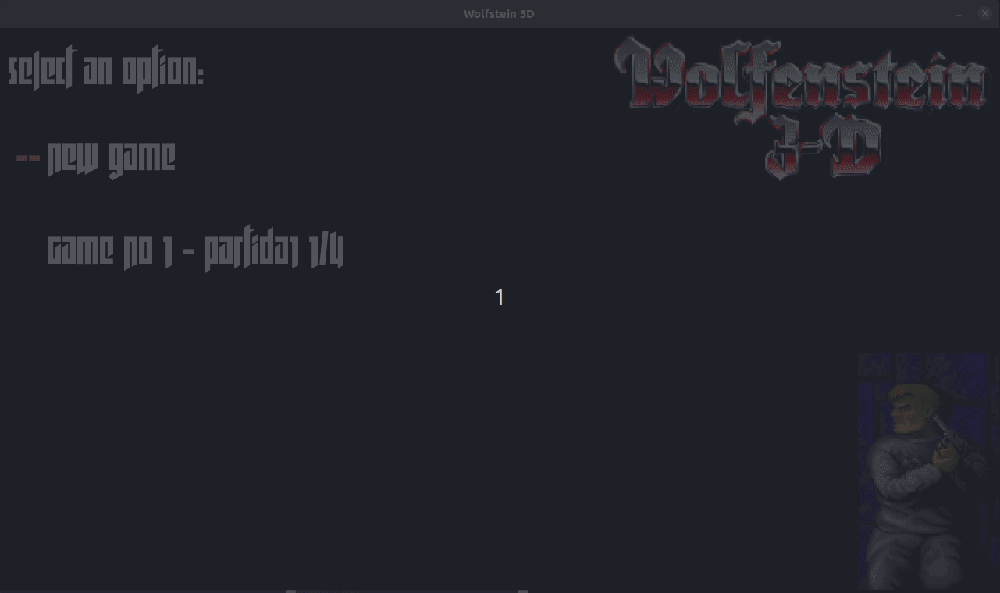
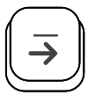
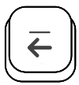
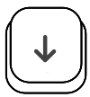
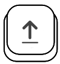
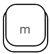

# Manual de Usuario

## Instalación

### Requerimientos de software
La instalación del programa se debe realizar mediante la instalación del paquete proporcionado. El programa puede ser corrido en cualquier distribución de Linux.


Si se quisiese compilar el código fuente se deberán instalar estos paquetes a través de apt.
* gtkmm-3.0-dev
* libsdl2-dev
* libsdl2-mixer-dev
* lua5.3 liblua5.3-dev
* libsdl2-ttf-dev
* libyaml-cpp-dev
* libsdl2-image-dev
* qt5-default

### Requerimientos de hardware
El programa fue probado en computadoras sin una placa gráfica especial, y con procesadores intel i5 e i7.

### Proceso de Instalación
Para poder utilizar el juego hay que realizar los siguientes pasos:
- Descargar el instalador
- Instalarlo (ver como instalar un .deb)
- Abrir una terminal (ctlr + alt + T)
  - Ejecutar el cliente!
```bash
foo@bar:~$ client [config.yaml]
```
  - Ejecutar el servidor!
```bash
foo@bar:~$ server config.yaml
```
  - Ejecutar el editor!
```bash
foo@bar:~$ mapeditor
```


## Configuración
Para levantar el servidor correctamente, se necesita un archivo con la configuración del mismo. Este deberá ser una archivo yaml de la siguiente manera:
``` yaml
port: 8080
rutaMapas: /home/user/mapas
mapas:
  - name: mapa1
    file: mapa1.yaml
  - name: mapa2
    file: mapa2.yaml
vRotacion: 
vAvance: 
vidaMax: 
balasPorRafagaAmetralladora: 
balasPorRafagaCanion: 
balasPorRafagaPistola: 
maxBalas: 
cantidadBalasInicial: 
distanciaMaxAcuchillable: 
puntos_cruz: 
punto_copa: 
punto_cofre: 
puntos_corona: 
cantidadVidas: 
puntos_balas: 
puntos_matar: 
danio_maximo_arma: 
precisionPistola: 
probalidad_acierto: 
```

Para el cliente hay un archivo de configuración opcional. Los valores por defecto son los siguientes. Para sobreescribirlo, crear un yaml con los valores deseados y pasarselo al correr el cliente.
``` yaml
screenWidthLogin: 1280
screenHeightLogin: 720
screenHeightGame: 600
screenWidthGame: 800
```

## Forma de uso
### Editor
Una vez levantado el editor se verá la siguiente ventana:


#### Crear un nuevo mapa
Para crear un nuevo mapa, ir a Archivo -> Nuevo (o ctrl + N). Se abrirá la siguiente ventana que permite elegir el tamaño deseado del mismo.
  

Una vez que tengamos el tamaño apropiado, para completarlo se pueden arrastrar las imágenes desde la lista izquierda. Haciendo doble click, se podrá pintar la superficie deseada:
   

**Importante!** El mapa debe ser un recinto cerrado de paredes y todos los clientes deben utilizar el mismo ancho  y alto de pantalla.  

#### Guardar el mapa
Para guardar el mapa una vez que ya este listo ir a Archivo -> Guardar. El mapa deberá ser un archivo .yaml o .yml

#### Abrir un mapa existente
Para editar un mapa ya existente, ir a Archivo -> Abrir. Seleccionar el archivo correspondiente y listo!

### Servidor
Una vez instalado correctamente, y ya teniendo el archivo de configuración, sólo falta levantar el servidor desde su carpeta, y listo!
```bash
foo@bar:~$ server config.yaml
```

### Cliente
Una vez levantado el cliente, se verá la pantalla de log in para conectarse al servidor deseado. Ingresar ip y puerto correspondiente:


Una vez conectado al servidor, se listaran las partidas existentes (en las que haya lugar disponible). Se puede unir a una, o de lo contrario crear una partida propia.


#### Crear una partida nueva
Para crear una partida nueva en el servidor, escribir una N y luego ingresar los datos correspondientes:

* Nombre de la partida
* Cantidad de jugadores posibles
* Ruta del archivo del mapa de la partida (mapa generado por el editor)
* Nombre del jugador


#### Conectarse a una partida existente
Para unirse a una partida nueva, escribir el número correspondiente y luego enter. Luego ingresar el nombre, y esperar!


#### Teclas para jugar  

 Rotar a la derecha

 Rotar a la izquiera

 Desplazarse abajo

 Desplazarse arriba

 Disparar

 Cambiar arma

 Abrir puerta

 Play/Stop música

## Apéndice de errores
